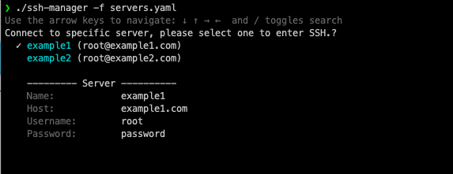

# SSH Manager

Managing multiple servers can be a cumbersome task, especially when you have to repeatedly SSH into each one using passwords. SSH Manager is here to make your life easier by allowing you to save server details in a file and effortlessly connect to them using a simple command-line interface.



## Installation

To get started with SSH Manager, follow these simple steps:

1. Clone the repository:

    ```bash
    $ git clone git@github.com:ejancorp/ssh-manager.git
    ```

2. Navigate to the project directory:

    ```bash
    $ cd ssh-manager
    ```

3. Make the script executable:

    ```bash
    $ sudo chmod +x ./ssh-manager
    ```

## Usage

Once you have SSH Manager set up, you can start using it to manage your servers. Here's how you can use it:

1. Prepare a YAML file (`servers.yaml`) containing details of your servers. The file should have the following format:

    ```yaml
    servers:
      - name: Server 1
        hostname: example.com
        username: user
        port: 22
        # Add more servers as needed
    ```

2. Run SSH Manager with the path to your YAML file:

    ```bash
    $ ssh-manager -f servers.yaml
    ```

3. SSH Manager will display a list of servers from your YAML file. Select the server you want to connect to by entering its corresponding number.

4. You will be prompted to enter your SSH password (if required), and SSH Manager will establish the connection for you.

## Contributing

Contributions are welcome! If you have any ideas, suggestions, or improvements, feel free to open an issue or submit a pull request.

## License

This project is licensed under the MIT License - see the [LICENSE](LICENSE) file for details.

## Acknowledgments

Special thanks to [ejancorp](https://github.com/ejancorp) for creating SSH Manager.

## Support

If you encounter any issues or need assistance, please don't hesitate to [contact us](mailto:your@email.com). We're here to help!

---

Happy server managing! 🚀
